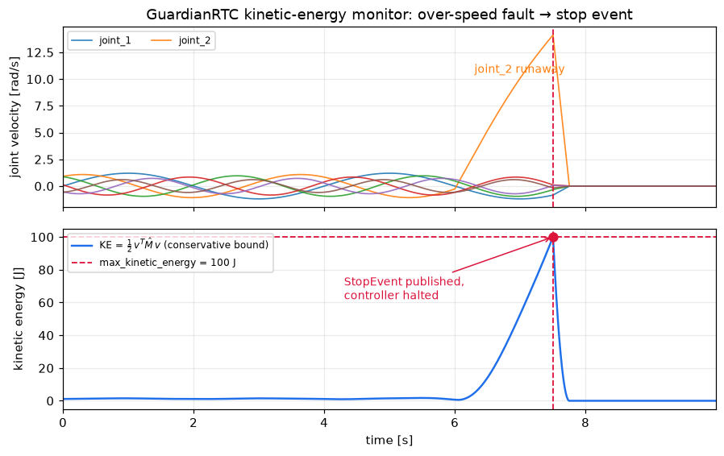

# GuardianRTC

A ROS 2 safety monitor for robotic arms — kinetic-energy-based stop events with WebRTC teleoperation — built as a prototype of the pattern, not a certified safety product.



*The check the safety node runs on every joint-state update, simulated over a
joint-2 runaway (`scripts/make_figures.py`): KE crosses `max_kinetic_energy`
and a `StopEvent` halts the controller.*

## Quick Start

1. Install ROS 2 Humble
2. Clone this repository
3. Build the workspace:
   ```bash
   cd ros_ws
   colcon build
   ```
4. Source the workspace:
   ```bash
   source install/setup.bash
   ```
5. Launch the system:
   ```bash
   ros2 launch guardian_rtc_core guardianrtc.launch.py
   ```

## Architecture

GuardianRTC provides:
- Kinetic-energy monitoring on every joint-state update (rate-capped at 1 kHz; best-effort on the rclpy executor, not hard real-time)
- WebRTC-based teleoperation interface
- SQLite & JSONL event logging
- Configurable safety limits per robot model

## Development

- Python 3.10+
- ROS 2 Humble
- WebRTC (aiortc)
- Docker support for development and CI

## ROS 2 Docker Development

### Building and Running the Container

1. **Build and start the container:**
   ```bash
   docker-compose -f docker/docker-compose.yml up -d --build
   ```
   This will create and start a container named `docker-ros-1` by default.

2. **Access the running container:**
   ```bash
   docker-compose -f docker/docker-compose.yml exec ros bash
   ```

3. **Build the ROS 2 workspace inside the container:**
   ```bash
   cd /ros_ws
   source /opt/ros/humble/setup.bash
   colcon build
   ```

4. **Source the workspace and run the test node:**
   ```bash
   source install/setup.bash
   ros2 run guardian_rtc_msgs test_stop_event
   ```

5. **To stop and remove the container:**
   ```bash
   docker-compose -f docker/docker-compose.yml down
   ```

## License

Apache 2.0 - See [LICENSE](LICENSE) for details.